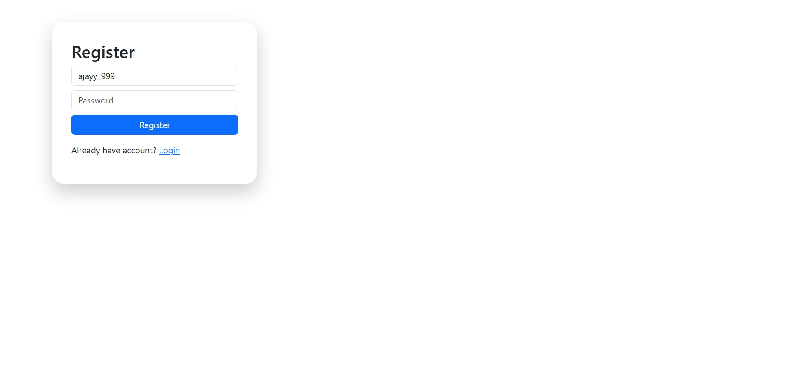
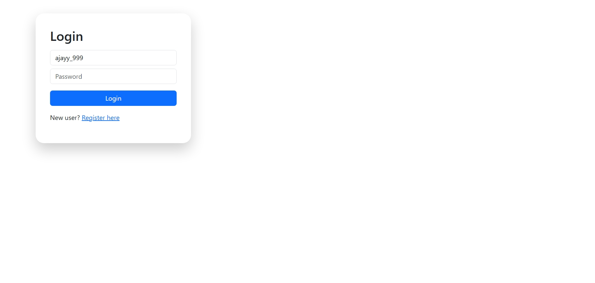
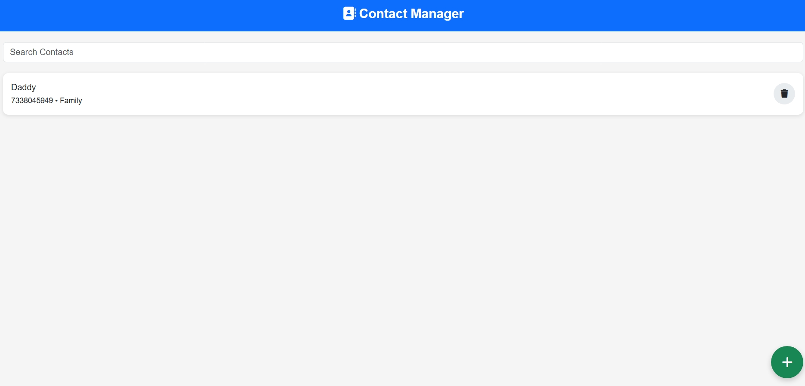

# Contact Book Web Application

A full-stack **Contact Management System** built using **HTML, Bootstrap, JavaScript, Node.js, Express, and MongoDB**.

This project allows users to **register, login, and manage personal contacts** with features like add, search, and delete — all stored securely per user.

---

## Features

*  User Authentication (Register & Login)
*  Add Contacts (Name, Phone, Category)
*  Search Contacts (User-specific)
*  Delete Contacts
*  Categories (Family, Friends, Work)
*  User-based Data Isolation (Each user sees only their contacts)
*  Clean Mobile-style UI

---

##  Tech Stack

**Frontend**

* HTML5
* Bootstrap 5
* JavaScript

**Backend**

* Node.js
* Express.js

**Database**

* MongoDB (Mongoose)

---

##  Project Structure

```
contact-book-pro/
│
├── backend/
│   ├── models/
│   │   ├── User.js
│   │   └── Contact.js
│   ├── routes/
│   │   ├── auth.js
│   │   └── contact.js
│   └── server.js
│
├── frontend/
│   ├── index.html
│   ├── dashboard.html
│   └── app.js
│
├── package.json
└── README.md
```

---

##  Installation & Setup

### 1️ Clone Repository

```
git clone https://github.com/your-username/contact-book-pro.git
cd contact-book-pro
```

###  Install Dependencies

```
npm install
```

###  Start MongoDB

Make sure MongoDB is running locally:

```
mongod
```

###  Run Backend Server

```
node backend/server.js
```

Server runs at:

```
http://localhost:5000
```

###  Run Frontend

* Open `frontend/index.html` using **Live Server** in VS Code

---

##  API Endpoints

### Auth

* `POST /api/auth/register` → Register user
* `POST /api/auth/login` → Login user

### Contacts

* `POST /api/contacts` → Add contact
* `GET /api/contacts/:userId` → Get user contacts
* `DELETE /api/contacts/:id` → Delete contact
* `GET /api/contacts/search/:userId/:key` → Search contacts

---

## Usage Flow

1. Register user (via API or UI)
2. Login with credentials
3. Add contacts using ➕ button
4. View contacts list
5. Search contacts
6. Delete contacts

---

## Notes

* This project uses a basic JWT setup for learning purposes
* MongoDB runs locally (`mongodb://127.0.0.1:27017/contactbook`)
* No environment variables used (can be added for production)

---

## Future Improvements

* ✏️ Edit Contact Feature
* 🔐 Protected Routes with Middleware
* 📧 Store User Email with Contacts
* 🌐 Deploy using Render / Vercel
* ⚛️ Convert to React (MERN Stack)

---






---
